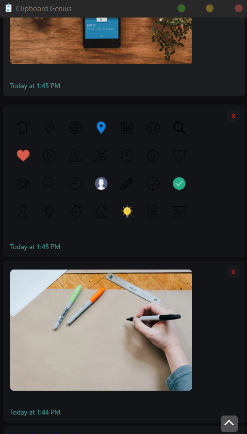
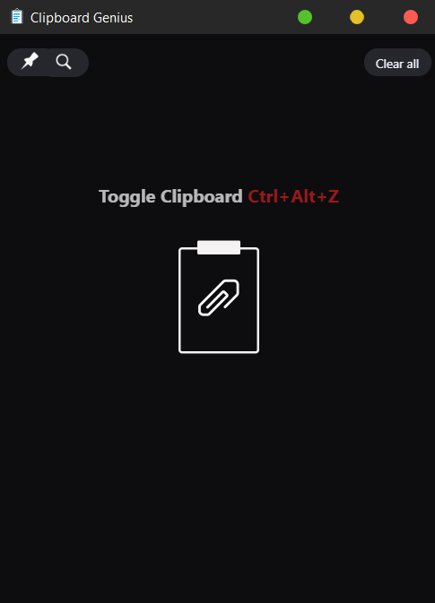

## Brief

A Clipboard manager built for developers making easing the development process. A Desktop application which automatically Highlights Syntax of everything you copy whilst keeping a backlog of snippets to use later on. 

* Automated Syntax highlighting based on language.
* Base64 image compression\
* Regex Sort & Filtering\
* Cache / Ram optimisation\
* Linux / Windows Compatible

## Images

