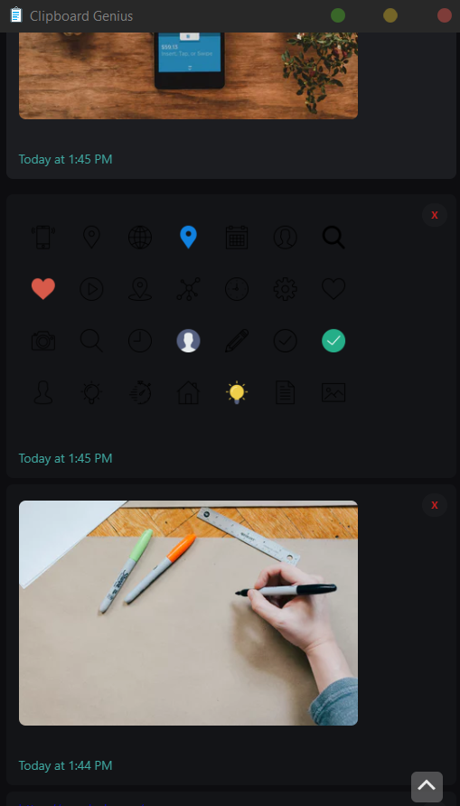

## Brief

A Clipboard manager built for developers. A Desktop application which automatically Highlights Syntax of everything you copy whilst keeping a backlog of snippets to use later on.industry.

* Automated Syntax highlighting based on language.
* Base64 image compression
* Regex Sort & Filtering
* Cache / Ram optimisation
* Linux / Windows Compatible

## Visual

